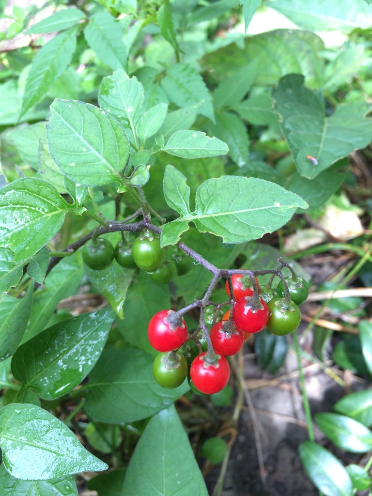

We have nightshade. Bittersweet or climbing nightshade it seems. We get a few plants a season and I do my best to pull it out by the roots as soon as I notice it. This year with the baby distraction I let a few go a bit too long. It's very easy to identify once it starts getting it's berries. It has purple flowers and is very vine like.

I'm going to do my best to get some photos next year as it starts growing. With the baby starting to crawl around, and our furry faithful companion and her curious ways this is one I'd like to not have in the yard.

The scientific name is Solanum Dulcamara. [Wikipedia](https://en.wikipedia.org/wiki/Solanum_dulcamara) has a bunch more info about it.
