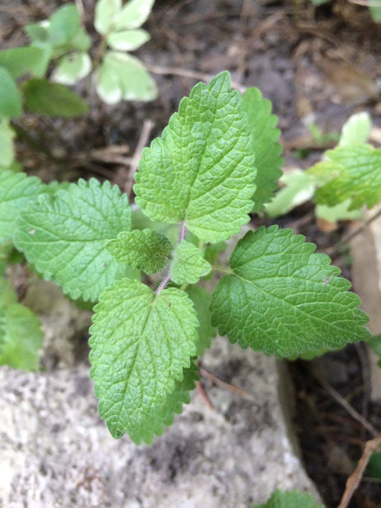
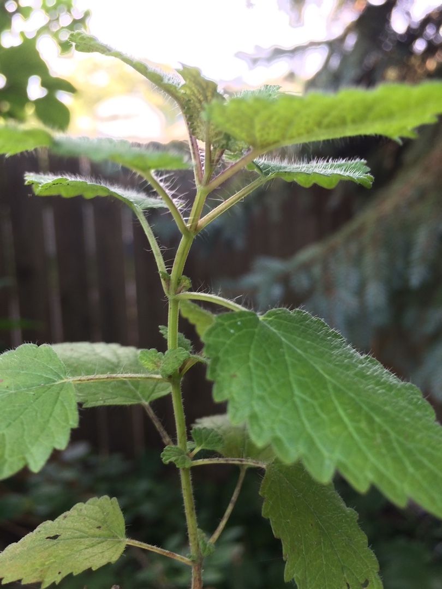

The lemon balm against our back fence has a story behind it. Our next door neighbors to the West confided in me that the lemon balm was planted on purpose at one point. They were hoping to have it on hand for the occasional cup of tea. It has since run wild. They have successfully won the war on their side of the fence. Now they must rely on me to keep it from spreading back. I don't personally know much about lemon balm, but here is what I do know.

* It spreads like wild fire
* It is relatively easy to pull out by the roots
* Even when you pull it out by the root it seems to come back the next year (or sooner)
* It does, in-fact, smell like lemons, which is actually pretty awesome

Against my better judgement my plan is to move a few plants worth to a hanging basket, hopefully containing the monster, while still having it available for the occasional cup of tea (or cocktail). I have had trouble growing anything in those hanging baskets, and hope that the heartiness and moxie of the lemon balm will put an end to my struggles. I'll just cross my fingers and hope it doesn't take over my yard, although that would be a nice smell while mowing. I **will** continue ripping it out by the roots whenever I see it in the wild (my yard) however.

Here is another shot of it from the side.

