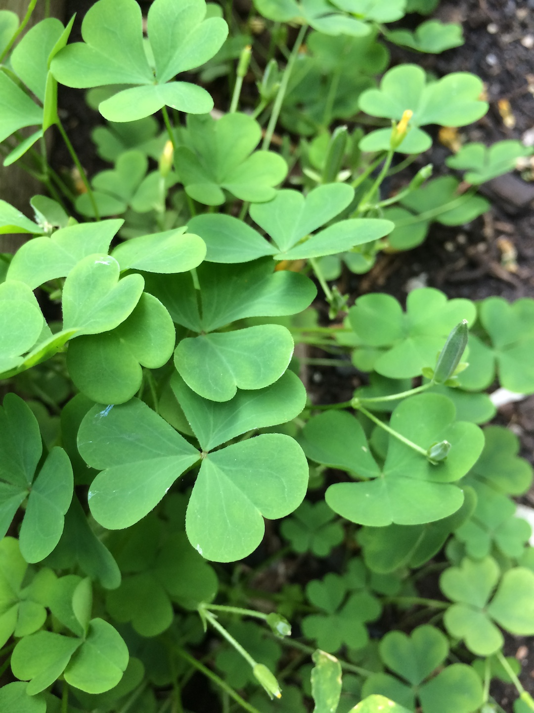

Looks like a clover, but with perfect heart shaped leaves. We have this growing as a weed all over the neighborhood. Finally a neighbor told me it was edible. It has a nice, sour flavor that goes very nicely in assorted salads. You can eat the entire plant, stems and all. I have also heard it called "lemon clover"

When I took my picture the sorrel's little yellow flowers had already died off, you can still *kind of* see them in the picture. They have long seed pods, but really the most identifiable thing about the wood sorrel is the perfect heart shaped leaves, and sour flavor.

If you're interested, here is the [Wikipedia article](https://en.wikipedia.org/wiki/Oxalis_stricta#Culinary_uses)
