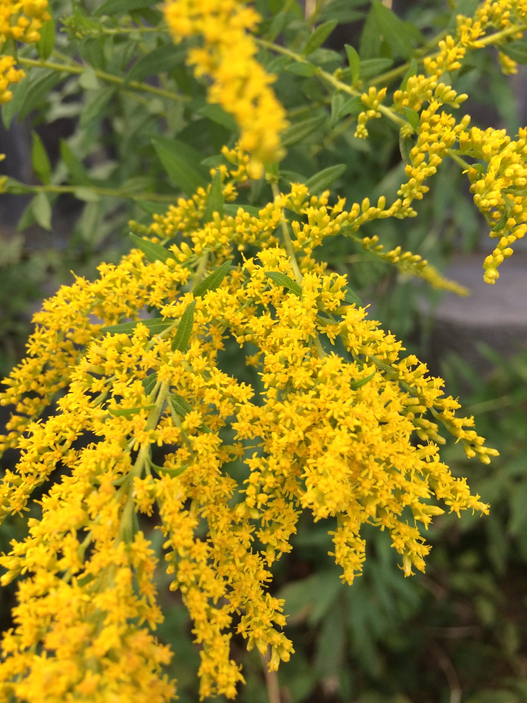
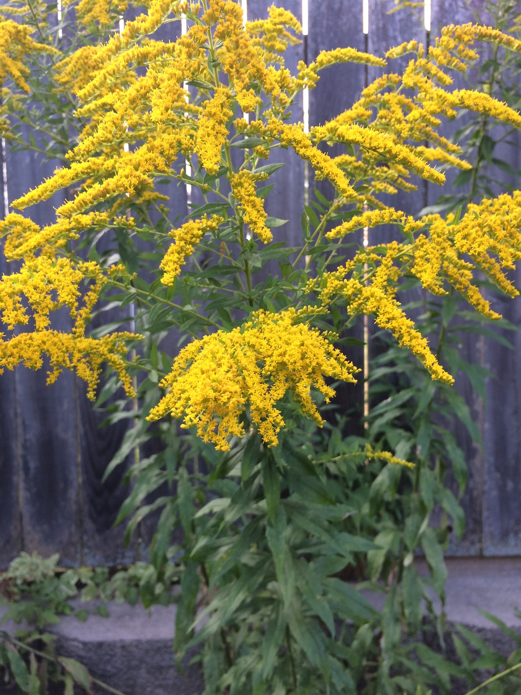

I'm not sure how I feel about goldenrod. On the plus side it blooms real late in the season, when nothing else is really blooming, and provides a nice color between the flowers of summer and the autumn leaves of fall. These photos were taken on August 30th, and the goldenrod in Milwaukee is in full bloom. On the down side it doesn't look that great all year as it grows, and it spreads like a weed (which I suppose it is).

I've heard conflicting accounts of its contribution to seasonal allergies. A trusted plant friend of mine told me that it gets a bad rap because it blooms at the same time as ragweed, and is blamed for a chunk of ragweed related allergies. Wikipedia confirms this ragweed/goldenrod theory.

This year I began removing large amount of it from our yard. I don't mind a few stalks, the pictures in this post are of goldenrod plants growing along my back fence, and I think it looks alright there. I'm going to do my best to be proactive about pulling most of it out, so next year I only have a few plants.

Here is a link to the [Wikipedia page for Goldenrod](https://en.wikipedia.org/wiki/Goldenrod)
