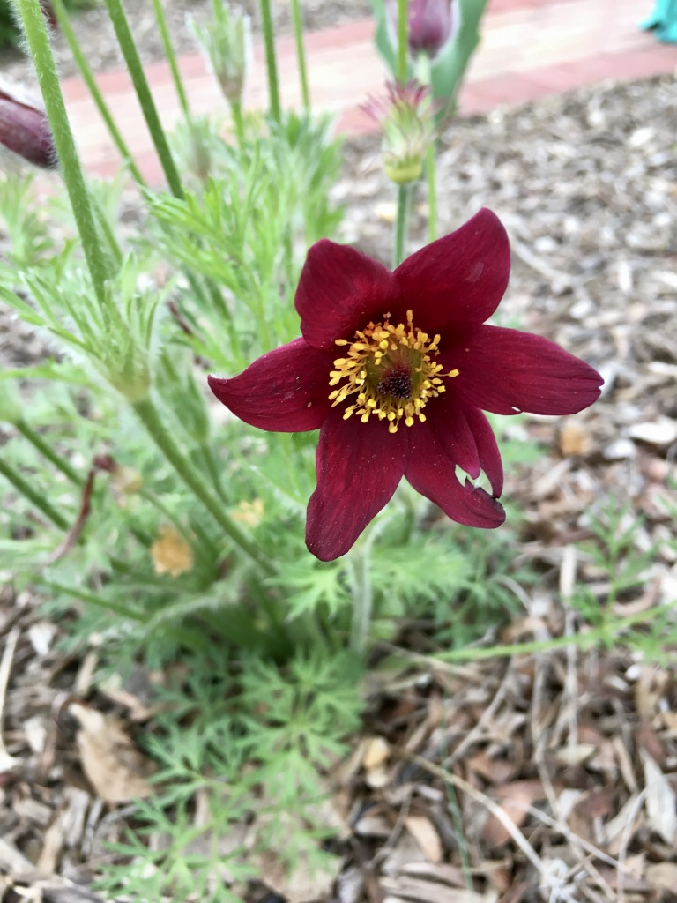
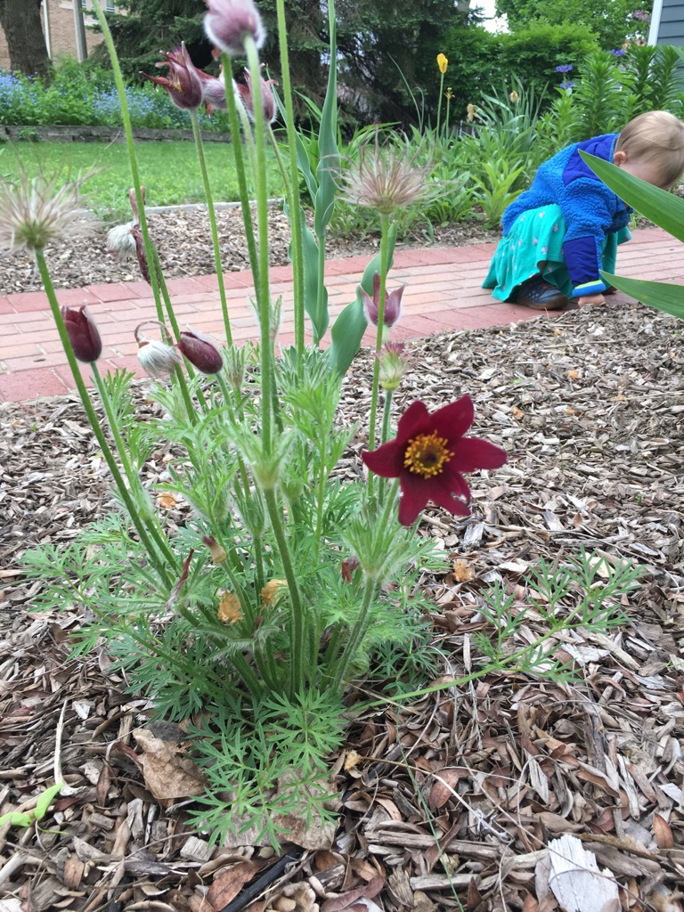

We love pasque flowers. We had a few in our front bed when we moved into the house, and have added a few more since then. They are native perennials and they bloom super early. The grow low to the ground so we use them along our front walkway, because they don't fall over and obstruct the path.

It has been used as a medicine by Native Americans for centuries. Blackfoot Indians used it to induce abortions and childbirth. Wikipedia says it's highly toxic though, so I assume we won't be eating it.

Here is a link to the [Wikipedia page for Pulsatilla (pasque flower)](https://en.wikipedia.org/wiki/Pulsatilla)
