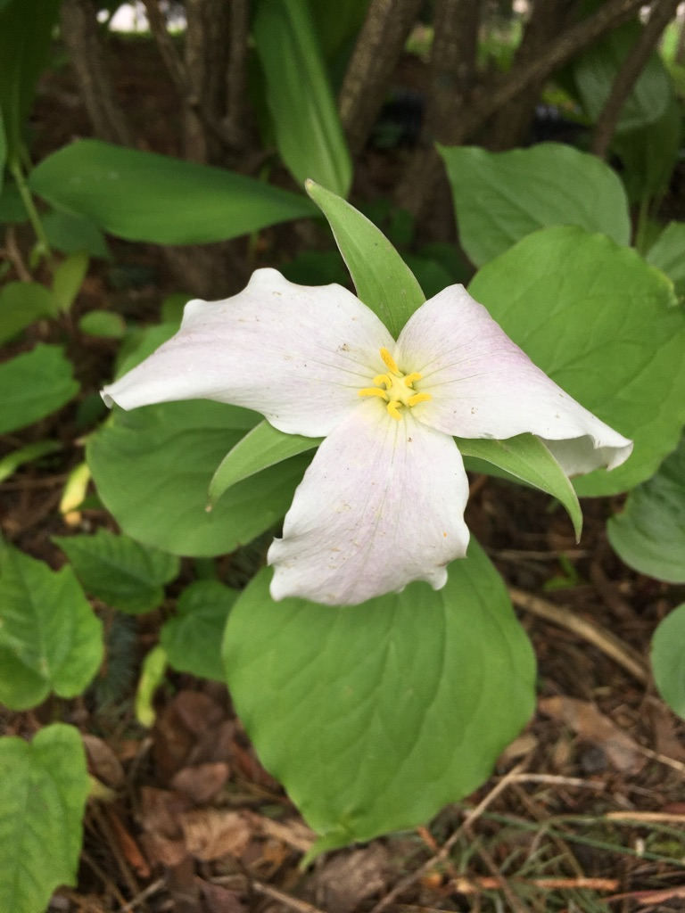

I had only ever heard the word trillium when talking about [the brewery](https://www.trilliumbrewing.com). Earlier this spring we were in Asheville, NC on a hike when my soon to be brother-in-law say some wild trillium flowers growing. Shortly there after I was walking Emmy home from her swimming lesson when we passed a fund-raiser native plant sale. They were selling trillium plants. What luck!?

I was told that the need only a little bit of sun, so I figured I'd put them under our mulberry tree in the front yard. It didn't take long for them to start looking pretty sad. I had no idea where they would be happy. A few days later, while mowing the lawn, I noticed that we had three trillium plants growing under a pine tree in our front yard. I have no idea how long they were there, but a journey that started 1,000 miles away in the mountains of western North Carolina, led me to notice three plants that had been 15 feet from my front door the whole time.

We transplanted our purchased trillium plants near the wild ones, and are hoping they come back next year.

Here is a link to the [Wikipedia page for Trillium](https://en.wikipedia.org/wiki/Trillium_grandiflorum)
