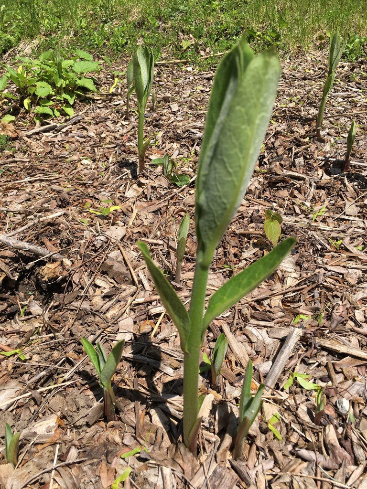

Do you like Monarch butterflies? [Milkweed can bring them around.](https://www.wpr.org/want-help-monarchs-plant-milkweed)

You have to be a little vigilant, because they seem to spread like wild fire, but they are super easy to pull. They are pretty easy to spot as they start coming up in the spring, and butterflies lay their eggs on the underside of the leaves. I'm a sucker for native flowers, so I'm happy to sport a grove of these guys in our front yard.

Back to the butterflies: milkweed is the only plant Monarch caterpillars eat. The decline of the Monarch population is attributed to the destruction of the milkweed population. So grow some in your yard.