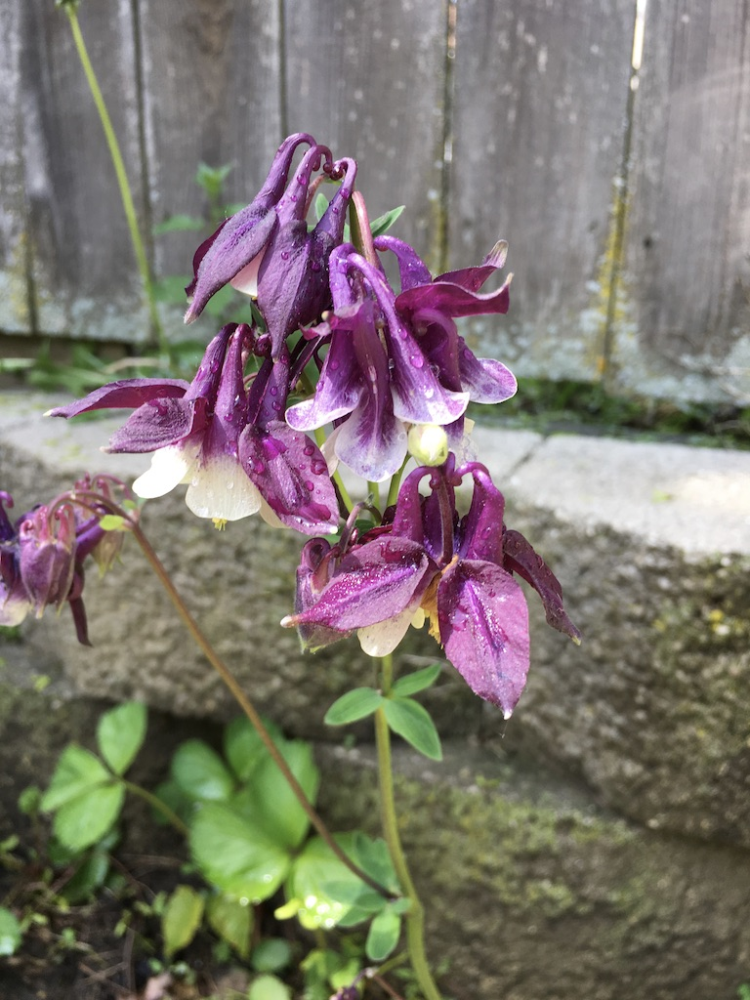
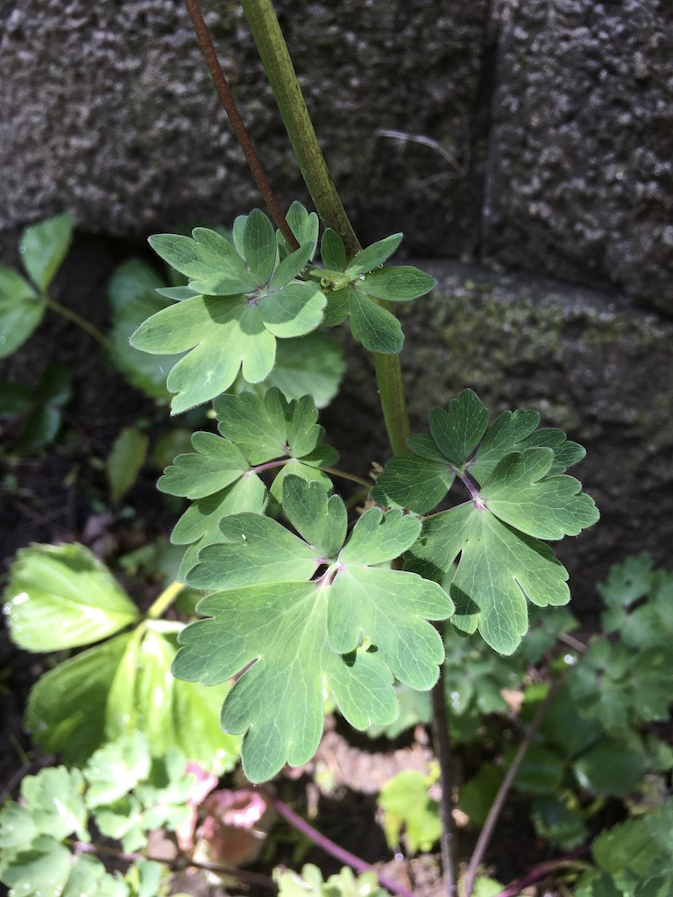

I always thought these were weeds, but now I know better. Columbine flowers pretty early in the season, in Milwaukee I'd say late May to early June. This photo was taken on June 3rd. The young plants are easily recognizable by their leaves and purple hue stems.

They are native to Wisconsin and seem to love bad soil. Every year we have them growing out of our garden wall and rocky soil between the raised beds. They seem to transplant well and spread.

Here is a link to the [Wikipedia page for Columbine](https://en.wikipedia.org/wiki/Aquilegia)
