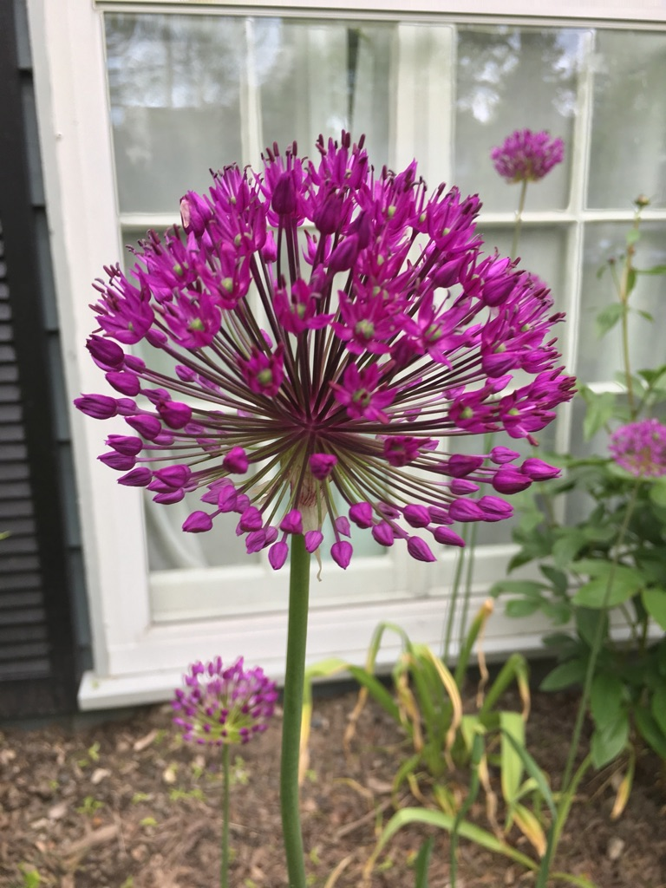

It looks like a Dr. Seuss creation. Closely resembles onion grass when it starts coming up in the spring. Ours get really tall.

Some species are poisonous to dogs and cats if consumed.

Here is a link to the [Wikipedia page for Allium](https://en.wikipedia.org/wiki/Allium)
