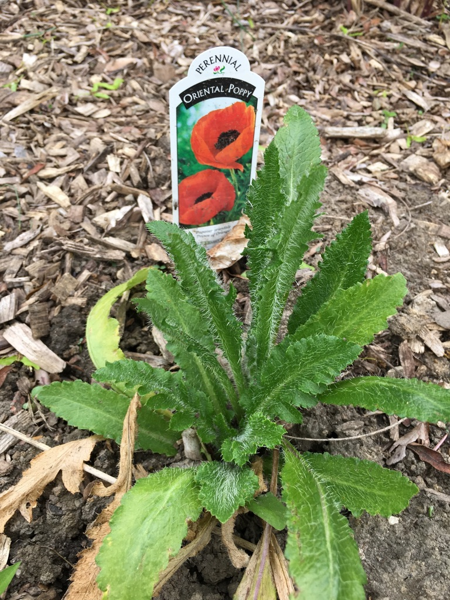

Poppies are one of my favorite flowers. We bough our first poppy plant last year a bit late for it to flower. It has come back but as of early June it hasn't flowered yet this year. We bought a few other varieties and planted them too, so fingers crossed that we can get some pictures of flowers sometime soon. Until then, here are pictures of what the look like in the spring before they flower.

Here is a link to the [Wikipedia page for poppies](https://en.wikipedia.org/wiki/Poppy)
