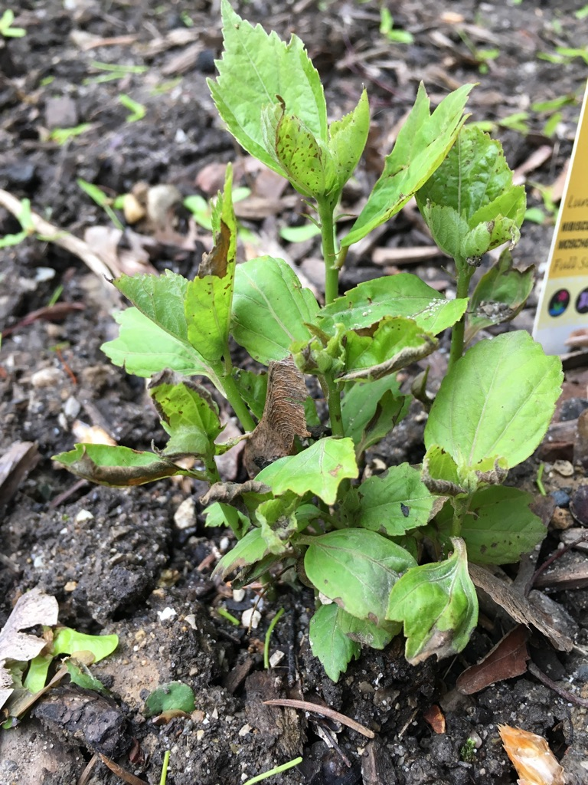
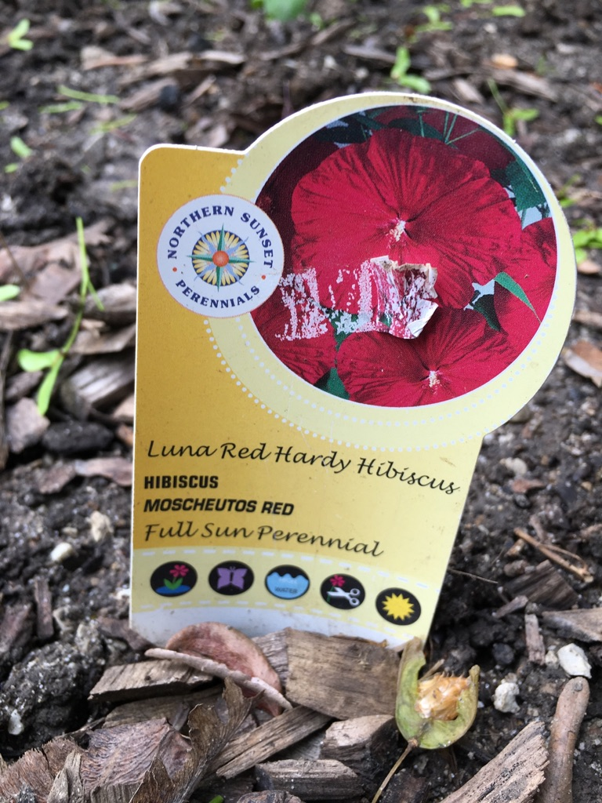

We tried to plant a Rose of Sharon near our house, but it didn't take. This year we were at our local greenhouse and decided to try out a pair of hibiscus bushes. This was just a few days ago, so nothing much to report. The tag says it likes full sun and plenty of water. I've read other stuff that suggests they need lots of nutrients. 10-10-10 fertilizer is recommended. The tag also says to prune it back to 6" or so in the fall.

Here is a link to what I think these bushes will be. [How to Care and Grow Hardy Hibiscus](https://www.americanmeadows.com/grow-hardy-hibiscus)
